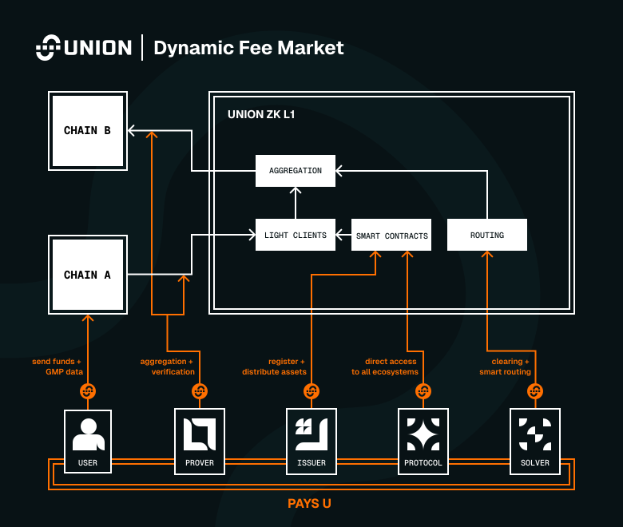
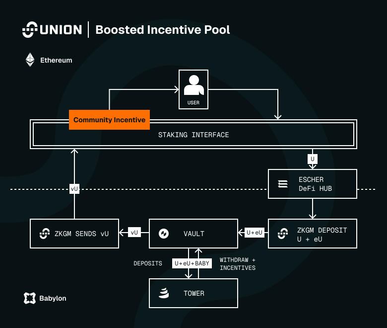
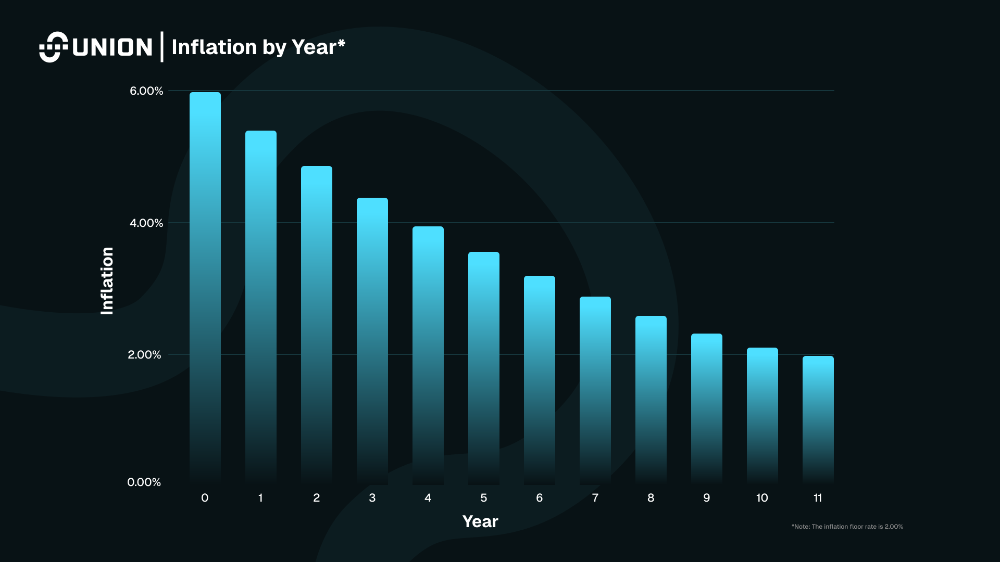
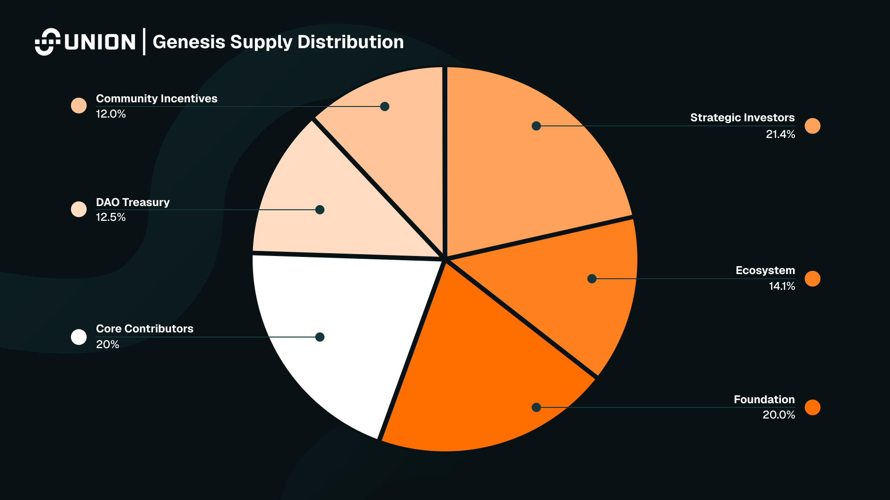
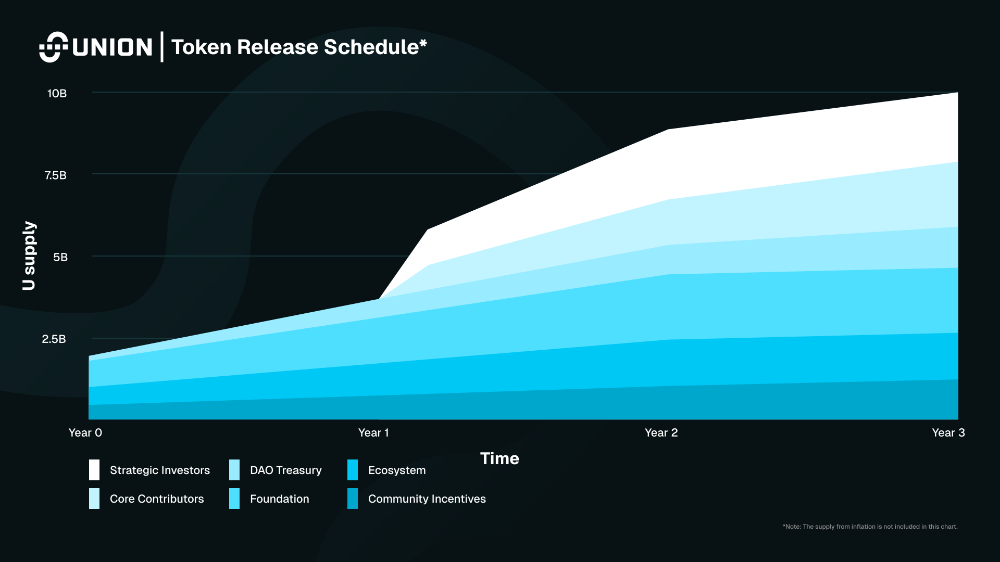

Union is the zero-knowledge (zk) interoperability network that functions as a settlement and liquidity layer for protocols and asset issuers. It is powered by the Union token, which is issued by the Union Foundation.

## Union Token at a Glance

| Property                   | Details                                    |
| -------------------------- | ------------------------------------------ |
| Symbol                     | U                                          |
| Name                       | Union                                      |
| Token Standard             | ERC20                                      |
| Contract Address           | 0xba5eD44733953d79717F6269357C77718C8Ba5ed |
| Genesis Supply             | 10,000,000,000                             |
| Initial Circulating Supply | 1,919,050,000                              |
| Decimals                   | 18                                         |
| Logo (PNG)                 | https://union.build/u.png                  |
| Logo (SVG)                 | https://union.build/u.svg                  |

## Union Token Utility

U (ERC20) is the native gas token of the Union network and serves three main functions within the Union ecosystem:

- Gas Token in the Dynamic Fee Market
- Network Security via Delegated PoS
- Crosschain Governance

Various Union products, such as [Auro BTC](https://union.build/blog/auro-btc-union-native-bitcoin-lst), will generate additional revenue for the Union protocol as well.

### Union Dynamic Fee Market

U is consumed whenever relayers, provers, or connected chains perform critical actions: paying to aggregate and verify zk proofs (a pay-for-compute market), maintaining and updating light clients, creating or freezing connections, and configuring new crosschain routes.

This usage forms the dynamic fee market where participants can pay more to control orderflow and prioritize critical crosschain operations. By tying token demand directly to proof verification and crosschain connectivity, U achieves intrinsic utility aligned with the network’s core function: secure, trustless interoperability at scale.

The token serves as the native gas token for the network, bought by protocols, relayers, and provers to aggregate proofs and relay transactions. Protocols like [Escher Finance](https://app.escher.finance/) require U to operate smart contracts and perform routing.

In short, U powers compute and message passing for users, while incentivizing relayers and provers to maintain and scale the interop network.

### Network Security

Union is a ZK L1, where U serves as the economic backbone for chain security, proof aggregation, and transaction ordering. Validators must stake U to participate in consensus and produce blocks, while token holders can stake U to support validators and receive token emissions.

Staking aligns incentives for network participants, creating economic security against malicious behavior and ensuring liveness of the interoperability layer. Unlike standard staking models, Union’s design incorporates crosschain staking, allowing participation from any connected ecosystem.

Finally, the ability to order bridge transfers through ordering of proof aggregation makes Union the first crosschain network where stake directly controls orderflow, making validator slots and U valuable.

### Crosschain Governance

Through Union's [Crosschain Governance](https://union.build/blog/crosschain-governance-by-union), U holders can stake and delegate to validators from any connected chain—starting with Ethereum—without bridging or leaving their native ecosystem. This allows token holders to contribute to critical decision-making, such as parameter changes, validator set updates, and protocol upgrades, by staking U and delegating their votes to Union network validators.

Over time, Union governance will support direct crosschain voting, composability with DeFi (e.g., staked positions as collateral), and lower liquidity fragmentation since users can participate without moving assets between chains.

## Denominations

| Category         | Ethereum (ERC20)                                           | Union ZK L1                                                       |
| ---------------- | ---------------------------------------------------------- | ----------------------------------------------------------------- |
| Symbol           | U                                                          | U                                                                 |
| Name             | Union                                                      | Union                                                             |
| Decimals         | 18                                                         | 18                                                                |
| Contract / Denom | 0xba5eD44733953d79717F6269357C77718C8Ba5ed (ERC20 address) | Primary denom: U Smallest denom: au (atto-U, 10^-18, SI unit) |

## Staking

Union is a Proof-of-Stake blockchain with a validator set that secures the network and powers its zk interoperability layer.

Staking U as a validator or delegator enables you to earn network rewards while securing Union’s crosschain messaging and light client infrastructure. Unlike traditional PoS chains, Union supports crosschain staking through its [Crosschain Governance module](https://research.union.build/Crosschain-Governance-21d79e5af45d80b8b466dcc773f7c811). This allows token holders to stake and delegate directly from connected chains like Ethereum, without first needing to bridge their tokens to the Union chain.

Validators earn rewards for producing blocks and verifying interoperability proofs, while delegators receive a share of those rewards minus the validator's commission fee.

| Consensus Mechanism        | Proof of Stake                                                                                  |
| -------------------------- | ----------------------------------------------------------------------------------------------- |
| Consensus Engine           | [CometBLS](https://docs.union.build/architecture/cometbls/), Union's ZK optimized CometBFT fork |
| Maximum Validator Set Size | 128                                                                                             |

<u>**Staking rewards**</u>:

- **Unlocked Tokens:** Holders of unlocked tokens, including those distributed through the Genesis Drop, will be able to earn staking rewards. Liquid staking will be available through [Escher Finance](https://www.escher.finance/).
- **Locked Tokens:** Staking rewards of Core Contributors and Strategic Investors will be locked for 12 months and will have the same vesting schedule as the underlying tokens. During this period, staking rewards can not be sold. Both Core Contributors and Strategic Investors (41.4% of supply) have agreed to lend their staking rewards to the Union Foundation for ecosystem incentives and delta neutral DeFi activities.

### Staking Vault

The Union Staking Vault is a crosschain vault that leverages a PCL strategy with arbitrage opportunities on the U/eU pool deployed on the [Tower DEX](https://www.tower.fi/) ([Babylon Genesis](https://babylonlabs.io/))..

Users can deposit U into the vault and receive vU, a token that represents their vault position.

**How it works**: The Union Staking Vault runs on four main components that work together across chains. On Ethereum, a liquid staking contract lets users stake U to mint eU, while the vault manager on Tower oversees the strategy and issues vU tokens to depositors. These U and eU tokens are then moved crosschain via Union’s relayer into the Babylon Genesis chain, where they’re deployed into the U/eU liquidity pool on Tower DEX. Tower uses a price-constrained liquidity (PCL) system to optimize trading and arbitrage opportunities.

The vault connects staking, liquidity provision, and crosschain transfers into one seamless system that earns rewards for users.

### Vault Parameters

| Estimated Reward Rate | 120% - 140% (first 6 months)                |
| --------------------- | ------------------------------------------- |
| Stake Time            | Immediate                                   |
| Unstake Time          | 48 hours (fast path), 27 days (secure path) |

### Deposit Flow

1. User connects their wallet on Ethereum.
2. Through the Escher/Union interface, the user deposits U.
3. A portion (≈50%, adjustable) is sent to the Escher LST contract to mint eU.
4. Both U and eU are transferred crosschain into the vault on Babylon Genesis.
5. The vault deploys tokens into the strategy (staking + liquidity on Tower DEX).
6. The user receives vU tokens in their EVM wallet, representing their vault position.

### Withdrawal Flow

1. User connects their wallet to the Escher/Union interface.
2. User submits a withdrawal request.
3. vU tokens are sent from the user back to the Babylon Genesis vault.
4. The vault burns the vU and begins the withdrawal process from Tower DEX liquidity pools and staking.
5. Tokens + accumulated rewards are transferred back to the user's wallet within 48 hours (for the fast path) or 27 days (for the secure path).

## Tokenomics

### Inflation

U will launch with an initial annual inflation rate of 6%, which will decrease by 10% each year until reaching a long-term issuance rate of 2%.

Staking rewards are dynamically calculated based on the proportion of tokens bonded. Union does not target a certain bonding ratio initially. This flexible design allows the network to balance security and decentralization while giving users the freedom to deploy U into the Union ecosystem or its projects for potentially higher rewards, aligning economic incentives with ecosystem growth.

### Genesis Supply Distribution

Union will have a total supply of 10,000,000,000 U at genesis, split across six categories described in the chart and table below.

| Category             | Description                                                                                                                                                                                                                                           | Cliff & Vesting                                            | Distribution |
| -------------------- | ----------------------------------------------------------------------------------------------------------------------------------------------------------------------------------------------------------------------------------------------------- | ---------------------------------------------------------- | ------------ |
| Community Incentives | Genesis Drop and Testnet: 4% Future Incentives: 8%                                                                                                                                                                                                | 4% at TGE, 8% for future airdrops and liquidity incentives | 12.0%        |
| Ecosystem            | Focused on community and ecosystem growth initiatives to drive adoption, such as developer programs, grants, accelerators, and fellowships. Administered by the Union Foundation.                                                                     | 40% unlock at TGE, 2 year linear vesting                   | 14.1%        |
| DAO Treasury         | The Union DAO will be governed directly by U token holders, who can propose and vote on initiatives that shape the network's roadmap, ecosystem, and growth. The DAO treasury will play a key role by incorporating community feedback and proposals. | 12.5% unlock at TGE, 3 year linear vesting                 | 12.5%        |
| Foundation           | Protocol reserves for network development, operations, marketing, integrations, and strategic partnerships.                                                                                                                                           | 40% unlock at TGE, 2 year linear vesting                   | 20.0%        |
| Strategic Investors  | Union's early backers from Seed and Series A rounds.                                                                                                                                                                                                  | 1 year cliff, 1 year linear vesting                        | 21.4%        |
| Core Contributors    | Core team members of Union entities and advisers.                                                                                                                                                                                                     | 1 year cliff, 2 year linear vesting                        | 20.0%        |

#### Key Features:

<u>**Community Alignment**</u>: Nearly 60% of the token supply is directed
toward users, builders, network development, and governance. By combining a
Genesis Drop, future community incentives, DAO-driven governance, and ecosystem
growth programs, as well as the Union Foundation that's dedicated to supporting
and developing the network, Union ensures that the majority of its tokens are in
the hands of those shaping the network.

<u>**DAO-driven Treasury**</u>: Union's DAO Treasury will be governed directly
by token holders. This mirrors the progressive decentralization seen in projects
like Uniswap, Lido DAO, and Arbitrum, where treasuries have become powerful
drivers of developer grants, liquidity programs, and ecosystem governance.

<u>**Clear Separation Between Foundation and DAO**</u>: The Foundation
allocation ensures operational resources for long-term network health (e.g.,
development, integrations, and partnerships), while the DAO treasury provides
community-directed growth capital. This separation strengthens accountability
and resilience.

### Token Release Schedule

The U token release schedule is structured with gradual unlocks for long-term community alignment. The design minimizes supply shocks by combining limited genesis unlocks with cliffs and multi-year vesting schedules across all major stakeholder groups. Staking rewards for locked tokens are vested according to the vesting schedule, and managed by the Union Foundation during their locked period. This ensures Union has sufficient economic security during the bootstrapping phase.

Community incentives, ecosystem growth, and DAO allocations are released steadily over time, ensuring tokens flow into productive long-term use cases. This approach creates predictability in circulating supply and enforces gradual unlocking schedules to avoid sharp supply shocks.

Core Contributors and Strategic Investors start with an unlock cliff followed by multi-year linear vesting, ensuring long-term commitment. To further smooth out the release schedule, cliffs are staggered through a 60-day linear vesting period at the 12-month mark.
