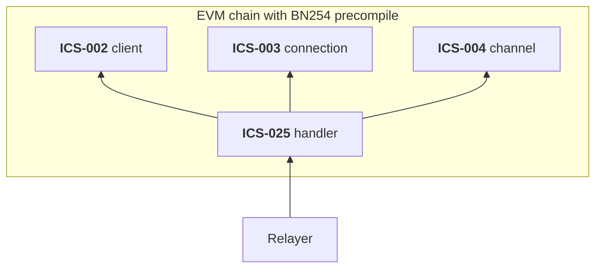

# EVM Architecture

This is where all of our EVM smart contracts live.

```mermaid
flowchart BT
    relayer[Relayer]

    subgraph EVM chain with BN254 precompile
        client["`**ICS-002** client`"]
        connection["`**ICS-003** connection`"]
        channel["`**ICS-004** channel`"]
        handler["`**ICS-025** handler`"]
    end

    handler --> client
    handler --> connection
    handler --> channel
    relayer --> handler
```
