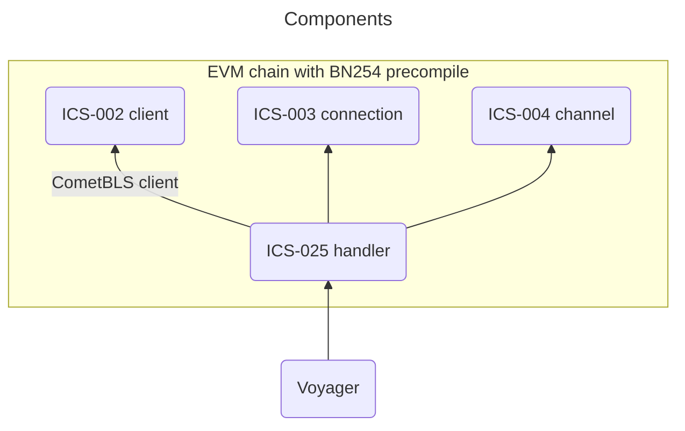
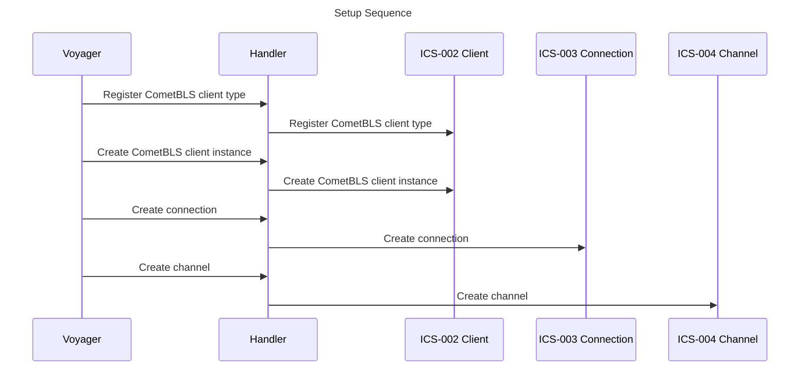

# EVM Architecture

This is where all of our EVM smart contracts live. The basis of this IBC in Solidity implementation is provided by [yui-ibc-solidity](https://github.com/hyperledger-labs/yui-ibc-solidity). We provide [CometblsClient](./contracts/clients/CometblsClient.sol), which is a light client that implements [CometBLS](../docs/docs/architecture/cometbls.md).

Note that all of the component upgrades are initiated from our Union chain through governance.

