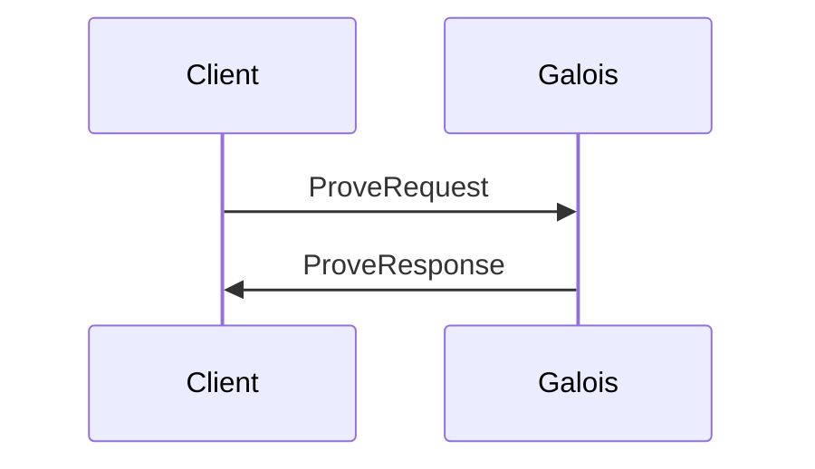
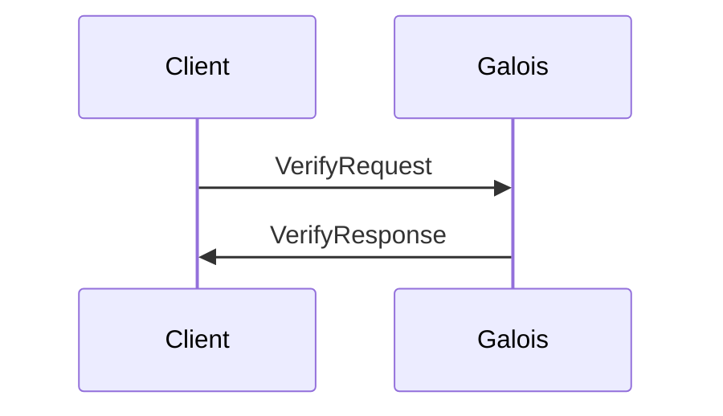

# Galoisd Architecture

Galoisd exposes gRPC endpoints to generate and verify CometBLS zero-knowledge proofs.

## Circuit

The CometBLS circuit is generic over $2^n$ validators. It is built to verify (non-)adjacent transitions between blocks.
We decided to implements the circuit on top of [Gnark](https://github.com/ConsenSys/gnark).
Galois includes the following **gadgets** that are not yet available in Gnark:

- a **merkle** gadget to re-compute the validator set MiMC merkle root in-circuit.
- a **emulated** gadget for `BN254` emulated $G_2$ arithmetic: addition, multiplication, scalar multiplication, mapping to curve and cofactor clearing.
- a **bls** gadget on top of emulated arithmetic for public key aggregation and signature verification.
- a **lightclient** gadget to verify CometBLS (non-)adjacent transition between blocks (public key aggregation, power threshold validation and signature verification).

## gRPC

[The gRPC service facilitate interactions with Galois.](./proot/api/v1/prover.proto)

### Proving

Proving require the client to submit a `ProveRequest` to the `Prove` endpoint.
The result will contains both a Gnark-compatible and EVM-compatible proofs.

### Verifying

Verifying is done through the `Verify` endpoint, by submitting a `VerifyRequest`.
The result is a boolean value telling whether or not the proof is valid.
Note that the provided as input is expected to be a Gnark-compatible proof and not the EVM variant.

