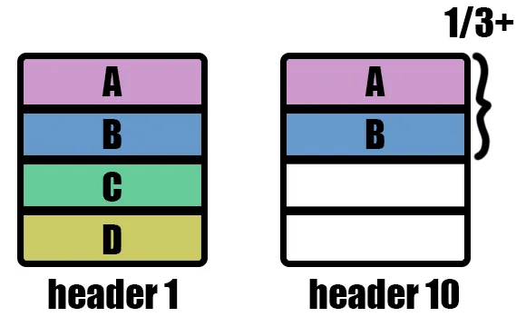
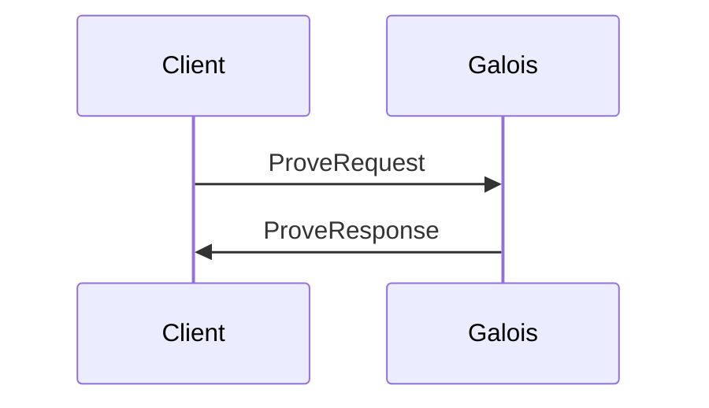
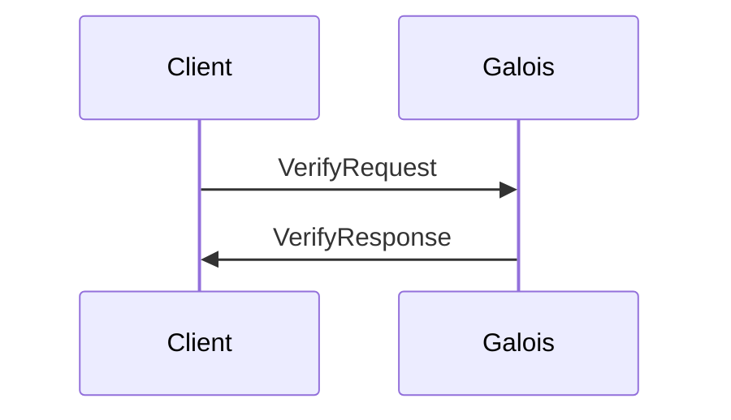

# Galoisd

Galois daemon (galoisd) is a gRPC service providing consensus proof generation for CometBLS block headers. It requires another service, such as an IBC relayer, to send block data for zpk generation.

The circuits developed under this service are tailored for the light client. Various implementations are partial and may not be sound if reused in a different context. We do not recommend reusing part of the circuits independently.

## Usage

Call `galoisd --help` to see an up-to-date overview of functions. The CLI is self-documenting.

### Local development

- Enter the union devshell with `nix develop`
- Run galoisd `nix run .#galoisd -- --help`

## Production Deployments

> **Warning**
>
> galoisd is not designed to be a public service. Proving is a computationally intensive process. Incorrectly configuring the service can lead to denial-of-service attacks.

### Docker

For production deployments, use the [docker image](https://github.com/unionlabs/union/pkgs/container/galoisd) provided in our package registry.

```sh
docker pull ghcr.io/unionlabs/galoisd:<VERSION>
```

### Nix

`nix run github:unionlabs/union/<COMMIT_OR_VERSION>#galoisd -- --help`


## Architecture

Galoisd exposes gRPC endpoints to generate and verify CometBLS zero-knowledge proofs.

### Circuit

The CometBLS circuit is generic over $2^n$ validators. It is built to verify (non-)adjacent transitions between blocks.
We decided to implements the circuit on top of [Gnark](https://github.com/ConsenSys/gnark).
Galois includes the following **gadgets** that are not yet available in Gnark:

- a **merkle** gadget to re-compute the validator set MiMC merkle root in-circuit.
- an **emulated** gadget for `BN254` emulated $G_2$ arithmetic for hashing to curve.
- a **bls** gadget on top of emulated arithmetic for public key aggregation and signature verification.
- a **lightclient** gadget to verify CometBLS (non-)adjacent transition signature between blocks (public key aggregation, validator set root verification, voting power threshold validation and signature verification).

#### Merkle circuit

Follows [RFC-6962 - Merkle Hash Trees](https://datatracker.ietf.org/doc/html/rfc6962#section-2.1) where the hash function is [`BN254-MiMC`](https://eprint.iacr.org/2016/492.pdf).

The circuit is generic over the size of the embedded tree, which is fixed by the parent circuit that contains it.
As a result, when computing the root, the caller must provide the current size of the tree, with any padding data intentionally discarded.

#### BLS circuit

The BLS circuit provides facilities to [aggregate](https://www.ietf.org/archive/id/draft-irtf-cfrg-bls-signature-05.html#name-fastaggregateverify) and verify signatures.

WARNING: When registering a public key (specifically a validator in this case), it is essential to provide a [proof of possession](https://www.ietf.org/archive/id/draft-irtf-cfrg-bls-signature-05.html#name-proof-of-possession) to prevent rogue key attacks.
The aggregation component of the circuit assumes that every public key being aggregated has been verified with a proof of possession prior to the proving process.

#### Cometbls Light Client

The light client circuits enable the verification of non-adjacent CometBLS blocks, analogous to Tendermint's existing non-adjacent verification functionality.



The prover must provide both trusted and untrusted validator sets, where a minimum of 1/3 of the trusted validators and 2/3 of the untrusted validators must have signed the block header.
If fewer than 1/3 of the trusted validators have attested the block, it is up to the caller to supply a valid checkpoint block (typically achieved through bisection) to satisfy the constraint.

The sole public input is a SHA-256 hash of all inputs to be verified:

```rust
let public_input = sha256(
    header.chain_id,
    header.height,
    header.time.seconds,
    header.time.nanoseconds,
    header.validators_hash,
    header.next_validators_hash,
    header.app_hash,
    trusted_validators_hash
) & 0x00FFFFFFFFFFFFFFFFFFFFFFFFFFFFFFFFFFFFFFFFFFFFFFFFFFFFFFFFFFFFFF;
```

Where `header` represents the new block header to verify and `trusted_validators_hash` is the `next_validators_hash` of the previously verified header. Furthermore, we truncate the most significant byte to fit the BN254 scalar field.

In the circuit, we proceed as follows:
- Recalculate the public input hash from the private inputs and verify that it matches the public input 31-byte hash.
- Recalculate the block hash.
- Hash the block hash to a G2 point on the BN254 curve, using [RFC
9380](https://www.rfc-editor.org/rfc/rfc9380.html).
- Verify that 1/3 of `trusted_validators_hash` have signed (recalculate and verify the validators hash,
aggregate public keys and verify signature).
- Verify that 2/3 of `header.validators_hash` have signed (recalculate and verify the validators hash,
aggregate public keys and verify signature).

Note that both signatures verified in-circuit must be computed by the caller.

The circuit is currently designed for a maximum of 128 validators.

### gRPC

[The gRPC service facilitate interactions with Galois.](./proot/api/v1/prover.proto)

#### Proving

Proving require the client to submit a `ProveRequest` to the `Prove` endpoint.
The result will contains both a Gnark-compatible and EVM-compatible proofs.



#### Verifying

Verifying is done through the `Verify` endpoint, by submitting a `VerifyRequest`.
The result is a boolean value telling whether or not the proof is valid.
Note that the provided as input is expected to be a Gnark-compatible proof and not the EVM variant.



