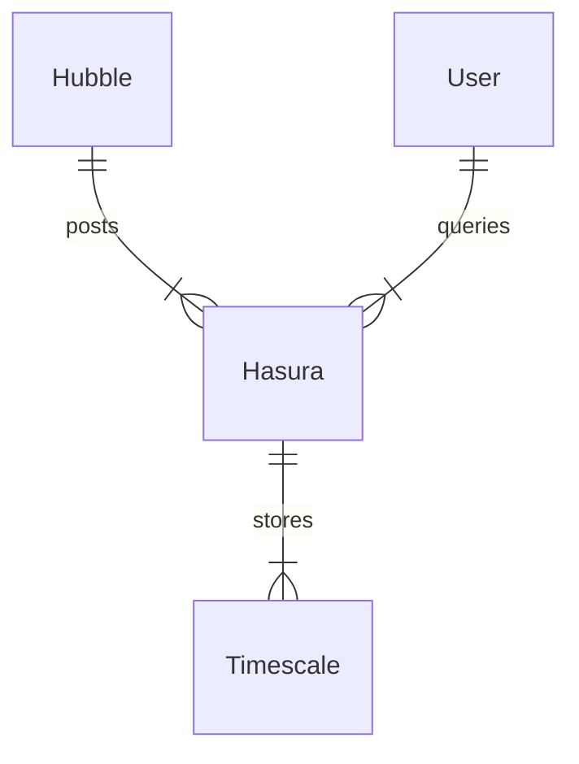

# Overview

Hubble spawns multiple indexers inside [tokio](https://tokio.rs/) tasks. Each indexer is configured through a JSON config passed through the CLI:

```
--indexers '[{"type": "tendermint", "url": "http://localhost:26657"}]'
```

Each indexer inserts data into a Postgres DB. The migrations are included in the `hasura` directory.



## Database Schema

Hubble is unopinionated regarding database schema. It has three conceptual models, chains, blocks, and events. Events are stored as JSONB, which means that further destructuring and aggregation occurs inside the DB itself. For this, we recommend [Timescale](https://github.com/timescale/timescaledb).

As an example, Tendermint's `coin_received` event can be destructured like so:

```sql
CREATE OR REPLACE VIEW "v0"."coin_receiveds" AS
 SELECT events.block_id,
    events.index,
    events."time",
    (((events.data -> 'attributes'::text) -> 0) ->> 'value'::text) AS receiver,
    ("substring"((((events.data -> 'attributes'::text) -> 1) ->> 'value'::text), '^\d+'::text))::numeric AS amount,
    "substring"((((events.data -> 'attributes'::text) -> 1) ->> 'value'::text), '[a-zA-Z].*'::text) AS denom
   FROM v0.events
  WHERE ((events.data ->> 'type'::text) = 'coin_received'::text);
```

DBAs should choose between using views or materialized views.

Data can be aggregated using time_buckets, and subsequently summed into totals, i.e. aggregate transfers into 1h buckets, and then sum over these buckets to obtain the current balances. Use [real-time aggregates](https://docs.timescale.com/use-timescale/latest/continuous-aggregates/real-time-aggregates/) for this.
