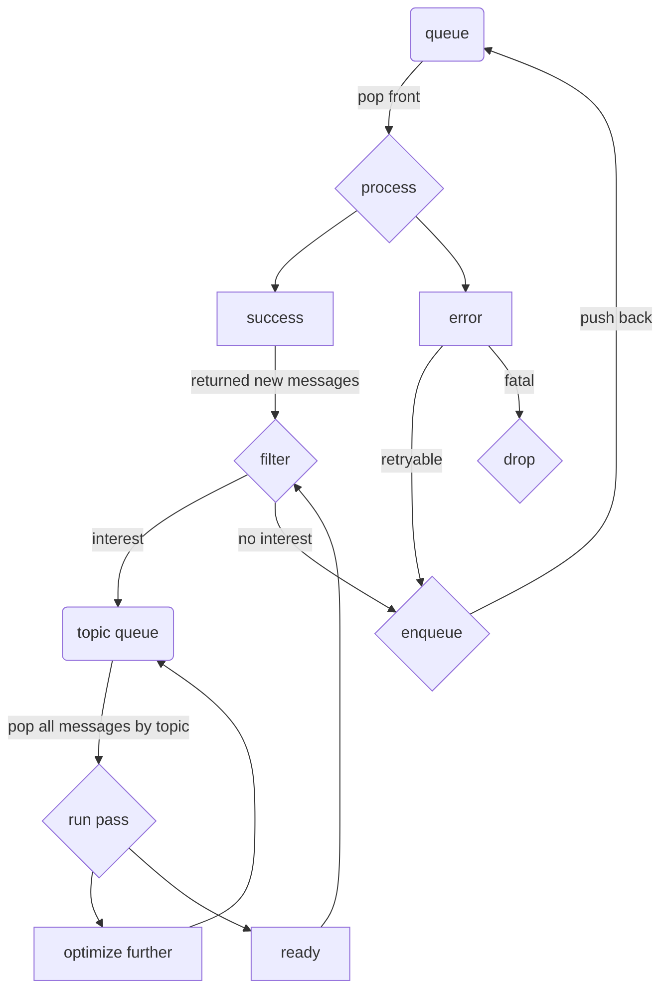

# `voyager-vm`

`voyager-vm` is a queue-based message processing system and high-level virtual machine. It functions similarly to [RabbitMQ] or [Kafka], while also providing additional components to build an efficient and reliable message-based program.

There are two queues. The main queue, which is a priority queue, is where messages are pulled from to be processed. Older messages are processed first, with new messages being pushed to the back. There is also the topic queue, where messages are tagged with a topic, and then a pass is run over all messages with the same topic. Messages are pushed to the topic queue based on an interest filter, which is run on every message before it is pushed to the main queue.

## Virtual machine semantics

Every message is defined as an opcode, which defines additional semantics. The main opcodes are:

- `Call`: Execute an action. This is the main opcode that will be used for most functionality.
- `Data`: An inert piece of data. Outside of `Promise`s, if this is not picked up by an interest filter, it will simply be dropped.
- `Promise`: Contains an internal queue. As items in that queue are processed, any returned `Data` messages will be pushed to it's internal data queue. Once all messages have been resolved, the callback is executed with the resolved `Data` messages.
- `Seq`: Contains a list of messages, which will be executed in order. The results of processing the first item in the list will be pushed back to the front.
- `Conc`: Contains a list of messages, which will be executed in a round-robin fashion. The results of processing the first item in the list will be pushed to the back of the list.
- `Defer`: Wait until the contained timestamp.

This enables building complex programs. For example, the program `seq([call(A), conc([B, C])])` defines messages `A`, `B`, and `C`, where `B` and `C` must occur after `A`.

[kafka]: https://kafka.apache.org
[rabbitmq]: https://www.rabbitmq.com
