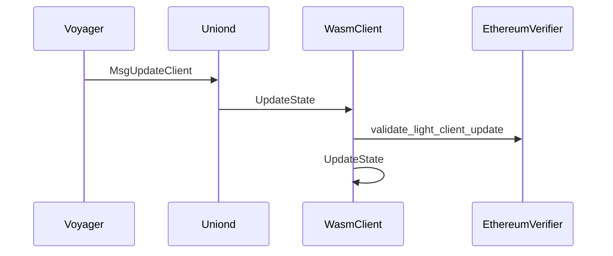
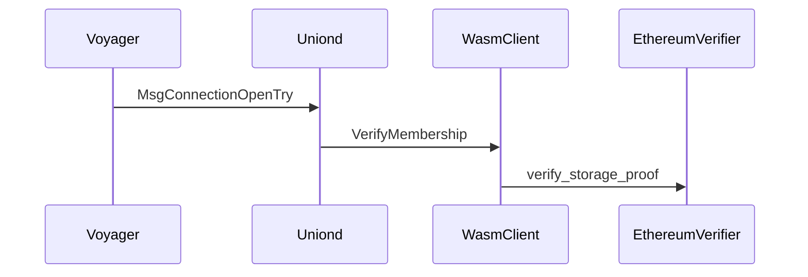

# Ethereum Light Client Architecture

Our [Ethereum](https://ethereum.org/) light client is a CosmWasm smart contract that implements the [wasm light client spec](https://github.com/cosmos/ibc/blob/main/spec/client/ics-008-wasm-client/README.md).
To see how this is integrated within `uniond`, see [uniond/ARCHITECTURE.md](../../uniond/ARCHITECTURE.md). We decided on implementing the light client as a smart contract instead of a native module because:

1. Native modules require chain-upgrade if we want to introduce the native client or update it. But the wasm light client can be uploaded and modified through governance.
1. `08-wasm` module already implements the generic client module and it only calls the underlying smart contract for the chain-specific parts like membership verification
   update validation, etc. This makes the implementation very clean and we don't have to implement any boilerplate code at all.
1. This generic client implementation can be easily adapted into different ecosystems that support wasm smart contracts.

We also implemented [ethereum-verifier](https://github.com/unionlabs/union/tree/main/lib/ethereum-verifier) to verify updates and commitments in the Ethereum side. We closely followed the [official consensus specs](https://github.com/ethereum/consensus-specs) from
Ethereum.

## Light Client Update

This diagram roughly describes the light client state update process, starting from our [Voyager](../../voyager/ARCHITECTURE.md)

## Membership verification

This diagram roughly describes the membership verification process. The sample process used here is connection handshake. The light client verifies whether the counterparty
client committed the necessary data.

