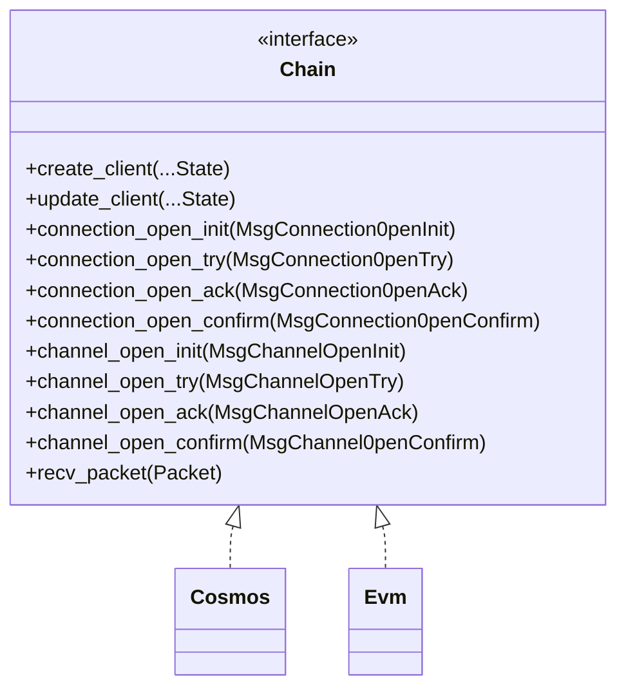
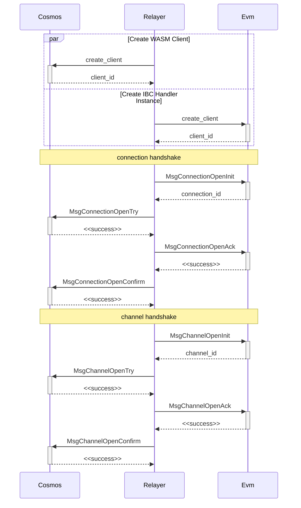
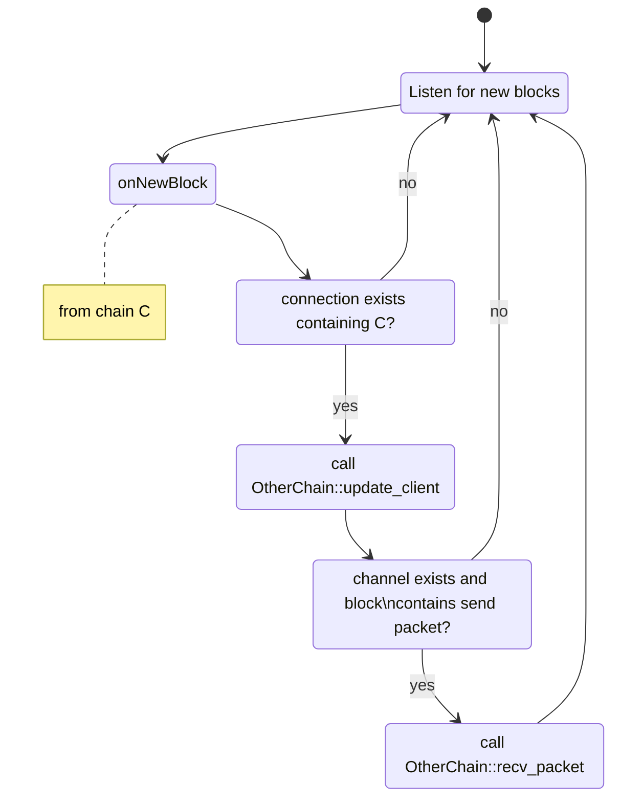

# Relayer Architecture

```mermaid
classDiagram
    class Chain {
		    <<interface>>

		    +create_client(...State)
		    +update_client(...State)

        +connection_open_init(MsgConnection0penInit)
        +connection_open_try(MsgConnection0penTry)
        +connection_open_ack(MsgConnection0penAck)
        +connection_open_confirm(MsgConnection0penConfirm)

        +channel_open_init(MsgChannelOpenInit)
        +channel_open_try(MsgChannelOpenTry)
        +channel_open_ack(MsgChannelOpenAck)
        +channel_open_confirm(MsgChannel0penConfirm)

        +recv_packet(Packet)
    }

    Chain <|.. Cosmos
    Chain <|.. Evm
```

## Handshake

```mermaid
sequenceDiagram
    participant Cosmos
    participant Relayer
    participant Evm

    par Create WASM Client
        Relayer->>+Cosmos: create_client
        Cosmos-->>-Relayer: client_id
    and Create IBC Handler Instance
        Relayer->>+Evm: create_client
        Evm-->>-Relayer: client_id
    end

		note over Cosmos, Evm: connection handshake

    Relayer->>+Evm: MsgConnectionOpenInit
    Evm-->>-Relayer: connection_id

    Relayer->>+Cosmos: MsgConnectionOpenTry
    Cosmos-->>-Relayer: <<success>>

    Relayer->>+Evm: MsgConnectionOpenAck
    Evm-->>-Relayer: <<success>>

    Relayer->>+Cosmos: MsgConnectionOpenConfirm
    Cosmos-->>-Relayer: <<success>>

		note over Cosmos, Evm: channel handshake

    Relayer->>+Evm: MsgChannelOpenInit
    Evm-->>-Relayer: channel_id

    Relayer->>+Cosmos: MsgChannelOpenTry
    Cosmos-->>-Relayer: <<success>>

    Relayer->>+Evm: MsgChannelOpenAck
    Evm-->>-Relayer: <<success>>

    Relayer->>+Cosmos: MsgChannelOpenConfirm
    Cosmos-->>-Relayer: <<success>>
```

## Main loop

```mermaid
stateDiagram-v2
    poll : Listen for new blocks
    [*] --> poll
    poll --> onNewBlock

    note right of onNewBlock : from chain C

    onNewBlock --> connExists

    connExists : connection exists containing C?

    connExists --> poll : no
    connExists -->  updateClient : yes
    updateClient : call OtherChain#58;#58;update_client

    updateClient --> chanExists
    chanExists : channel exists and block\ncontains send packet?

    chanExists --> poll : no
    chanExists --> relayPacket : yes

    relayPacket : call OtherChain#58;#58;recv_packet

    relayPacket --> poll
```
