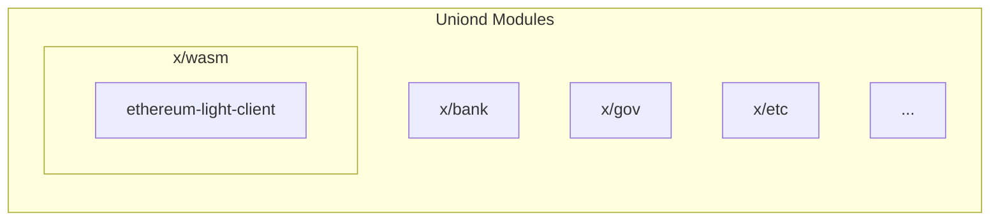

# Uniond Architecture

Uniond is a [Cosmos SDK](https://github.com/cosmos/cosmos-sdk) based blockchain consisting of a set of modules. The most notable module is our **Ethereum Light Client** which is written in [Rust](https://www.rust-lang.org/) and compiled to [WebAssembly](https://webassembly.org/), after which it is passed on to [x/wasm](https://github.com/CosmWasm/wasmd/tree/main/x/wasm), the CosmWasm module.

## Ethereum Light Client

The Ethereum Light client is [defined here](../light-clients/ethereum-light-client/ARCHITECTURE.md).
