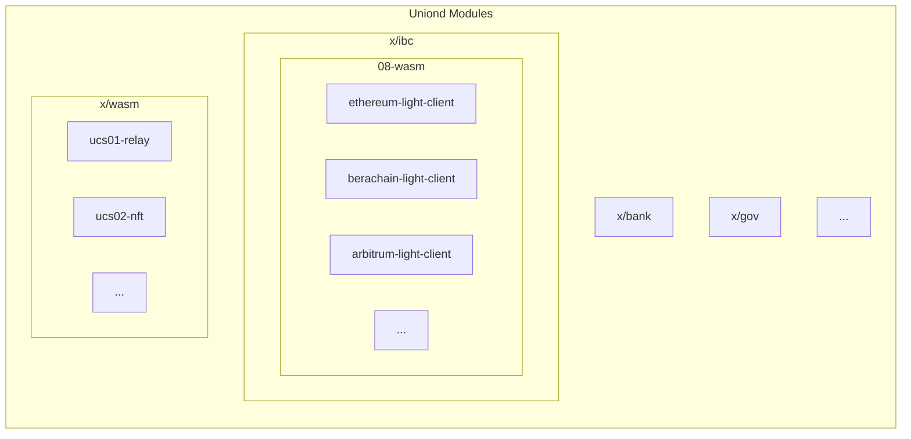

# uniond

**uniond** is the canonical implementation of a full node for the union network. Validators, RPC, and archive operators can run it to participate in the network.

## Getting started

The easiest way to obtain the `uniond` binary is to check the [releases](https://github.com/unionlabs/union/releases). Alternatively, they can be built from source by running:

```sh
nix build .#uniond
```

### Usage

For an overview of the commands and usage, run:

```sh
/path/to/uniond --help
```

The commands are self-explanatory and can be used to both run a node and interact with the network over a command-line interface.

### Production Usage

When running `uniond` in production, we recommend using [`unionvisor`](../unionvisor/README.md).

## Architecture

Uniond is a [Cosmos SDK](https://github.com/cosmos/cosmos-sdk) based blockchain consisting of a set of modules. 



The most notable module is **x/ibc**, as it contains [08-wasm](https://ibc.cosmos.network/main/ibc/light-clients/wasm/overview/). This allows us to write 
**Light Clients** in [Rust](https://www.rust-lang.org/), compile them to [WebAssembly](https://webassembly.org/), and upload them to the `uniond` chain to support many ecosystems.

You can find the light clients [here](../light-clients).

Notably, `uniond` also contains `x/wasm`, which we use to upload [our CosmWasm contracts](../cosmwasm).
