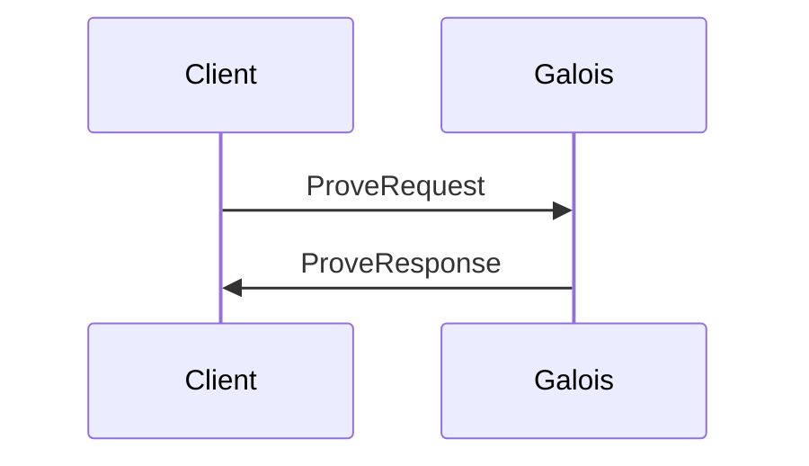
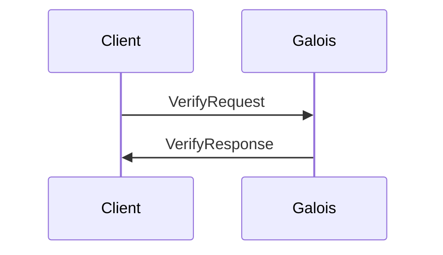

# Galois Architecture

Galois exposes gRPC endpoints to generate and verify CometBLS zero-knowledge proofs.

## Circuit

The CometBLS circuit is generic over $2^n$ validators. It is built to verify non-adjacent transitions between blocks.
We decided to implements the circuit on top of [Gnark](https://github.com/ConsenSys/gnark).
Galois includes the following **gadgets** that are not available in Gnark:

- a **protobuf** gadget for deserialization of protobuf payloads.
- a **SHA-256** gadget to verify CometBLS hashes (derived from Cometbft, almost everything is hashed with sha256).
- a **Merkle Root** gadget to re-compute merkle root in-circuit (using the **SHA-256** gadget for instance).
- a **CometBLS** gadget to verify non-adjacent transition between blocks (signature aggregation, verification, validator power etc...).
- a **$G_2$ Arithmetic** gadget that emulates `BN254` $G_2$ operations on top of `BN254` curve (signature aggregation).
- a **MapToG2** gadget that implements mapping on $G_2$, with scalar multiplication for cofactor clearing (optimized cofactor clearing is too complicated to implement in-circuit).

## gRPC

[The gRPC service facilitate interactions with Galois.](./proot/api/v1/prover.proto)

### Proving

Proving require the client to submit a `ProveRequest` to the `Prove` endpoint.
The result will contains both a Gnark-compatible and EVM-compatible proofs.

### Verifying

Verifying is done through the `Verify` endpoint, by submitting a `VerifyRequest`.
The result is a boolean value telling whether or not the proof is valid.
Note that the provided as input is expected to be a Gnark-compatible proof and not the EVM variant.

