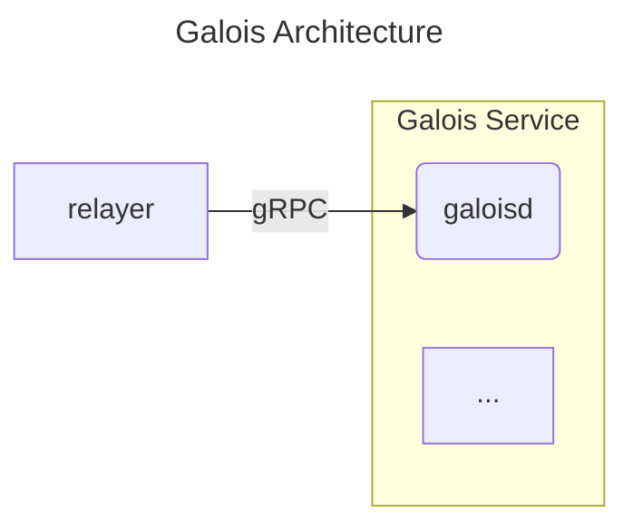

# Galois Architecture

The Galois circuit is generic for $2^n$ validators.

```mermaid
---
title: Galois Architecture
---
graph LR
  relayer
  subgraph Galois Service
    galoisd(galoisd)
      ...
  end

relayer--gRPC-->galoisd
```

## Gadgets

Galois includes the following **gadgets**:

- Protobuf
- SHA-256
- Merkle Tree
- CometBLS
- G2 arithmetic
