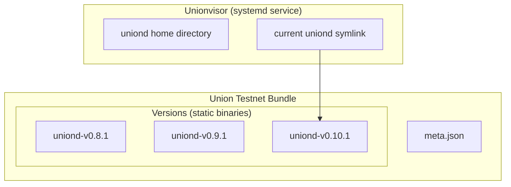

# Unionvisor Architecture

**Unionvisor** is an optional (and recommended) supervisor for `uniond`. It is a `systemd` service that manages the lifecycle of `uniond` by managing a symlink called `current`, and swapping this symlink to the newer `uniond` version when an upgrade signal occurs.

**Union Bundles** are directories of static binaries containing each version of `uniond` for a specific network (`union-testnet-2`, for example). They also contain a `meta.json` describing the bundle's structure.

_Unionvisor consumes Union Bundles_. When configuring Unionvisor, you provide a _Union Bundle_ such as the `bundle-testnet` that is defined on our flake. When an upgrade signal occurs, Unionvisor will swap the `current` symlink to the newer version of `uniond` in the bundle.

## Unionvisor and Union Bundles

